# AWS Certified Solutions Architect – Associate (SAA-C03)

## 1. AWS Global Infrastructure

AWS Global Infrastructure consists of:

- **AWS Regions**
- **Availability Zones (AZs)**
- **Data Centers**
- **Points of Presence (PoPs) / Edge Locations**

---

### 1.1 AWS Regions

An **AWS Region** is a geographical area that contains multiple isolated **Availability Zones**.

- Most AWS services and resources are **Regional**.
- Examples of Regional services:
  - Amazon EC2
  - Amazon RDS
  - Amazon VPC
  - Amazon Rekognition

> **Note:** Some AWS services are **Global**, while others are **Regional**.

---

### 1.2 How Do We Choose an AWS Region?

When selecting an AWS Region, consider:

1. **Compliance**
   - Regulatory requirements may require data to remain in a specific geographical location.

2. **Latency**
   - Choose a Region closer to users to reduce latency.

3. **Available Services**
   - Not every AWS service or feature is available in every Region.

4. **Pricing**
   - AWS pricing may vary between Regions.

---

### 1.3 AWS Availability Zones (AZs)

An **Availability Zone** consists of **one or more discrete data centers** within an AWS Region.

Characteristics:

- Each Region contains multiple **Availability Zones**.
- AZs are physically separated from one another.
- AZs are connected through **high-bandwidth, low-latency networking**.
- Deploying resources across multiple AZs improves:
  - **High Availability**
  - **Fault Tolerance**

> **Exam Tip:** For **High Availability**, distribute resources across **multiple Availability Zones**.

---

### 1.4 AWS Data Centers

AWS Data Centers provide the physical infrastructure that powers AWS services.

- A single **Availability Zone** can contain **one or more physically separate data centers**.
- Data centers contain the physical servers, storage, and networking infrastructure used by AWS.

---

### 1.5 AWS Points of Presence (PoPs) / Edge Locations

AWS Points of Presence include:

- **Edge Locations**
- **Regional Edge Caches**

They are primarily used by services such as:

- Amazon CloudFront
- AWS Global Accelerator

Their main purpose is to deliver content and network traffic closer to users and reduce latency.

---

### 1.6 AWS Global Services

Common AWS Global services include:

- **Identity and Access Management (IAM)**
- **Amazon Route 53**
- **Amazon CloudFront**
- **AWS WAF**

> **Important:** **Amazon Rekognition is a Regional service.**

## 2. IAM & AWS CLI

IAM stands for **Identity and Access Management**.

IAM is used to securely manage:

- **Authentication** → Who are you?
- **Authorization** → What are you allowed to do?

IAM is a **Global AWS service**.

---

### 2.1 IAM Users and Groups

**IAM Users**

IAM Users typically represent:

- **People within an organization**
- Applications that require **long-term credentials**

**IAM Groups**

IAM Groups are collections of IAM Users.

Important rules:

- A User can belong to **multiple Groups**.
- A User can belong to **zero Groups**.
- Groups **cannot contain other Groups**.

---

### 2.2 IAM Policies

IAM Policies define **permissions**.

Policies can be attached to:

- **IAM Users**
- **IAM Groups**
- **IAM Roles**
---

### IAM Policy Structure

A policy can contain:

- `Version` → Specifies the **policy language version**
- `Id` → **Optional** identifier for the policy
- `Statement` → **Required** and contains one or more permission statements

Each Statement can contain:

- `Sid` → **Optional** statement identifier
- `Effect` → **Required**; either `Allow` or `Deny`
- `Principal` → Depends on the **policy type**
- `Action` → AWS actions that are allowed or denied
- `Resource` → AWS resources to which the policy applies
- `Condition` → **Optional** conditions under which the policy applies

> **Important:** `Principal` is generally used in **Resource-Based Policies** and **IAM Role Trust Policies**. It is not normally included in an **Identity-Based Policy**.

IAM Permission Example

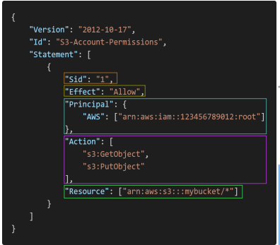
---

### 2.3 IAM Policies – Inline vs Managed Policies

**Inline Policies**

An **Inline Policy** is embedded directly into a single IAM identity.

It can be attached directly to:

- **IAM User**
- **IAM Group**
- **IAM Role**

Characteristics:

- Has a **one-to-one relationship** with the IAM identity.
- Cannot be reused across multiple identities.
- Deleted when the associated identity is deleted.

**Managed Policies**

Managed Policies are standalone IAM policies that can be attached to multiple IAM identities.

There are two types:

**AWS Managed Policies**

Policies created and managed by **AWS**.

**Customer Managed Policies**

Policies created and managed by the **customer**.

> **Exam Tip:** Use **Managed Policies** when the same permissions need to be reused across multiple IAM identities.

---

### 2.4 IAM Password Policy

AWS allows you to configure an **IAM Password Policy**.

You can:

1. Set a **minimum password length**.
2. Require **specific character types**.
3. Allow IAM Users to change their own passwords.
4. Require Users to change their passwords after a specific period.
5. Prevent **password reuse**.

---

### 2.5 MFA – Multi-Factor Authentication

MFA adds an additional layer of security.

Authentication factors include:

- **Something you know** → Password
- **Something you have** → MFA Device

MFA should be enabled for:

- **AWS Root User**
- **IAM Users** with console access

**MFA Device Options**
There are two MFA options 

**Virtual MFA Device**

Examples:

- **Google Authenticator**
- **Authy**

These applications generate temporary authentication codes.

**Hardware Security Key**

Example:

- **YubiKey**

A physical security device used for authentication.

---

### 2.6 AWS Access Methods

AWS can be accessed in multiple ways:

- **AWS Management Console**
- **AWS Command Line Interface (CLI)**
- **AWS Software Development Kit (SDK)**

---

**AWS Management Console**

The AWS Management Console is a web-based interface for managing AWS resources.

Authentication typically involves:

- **Username**
- **Password**
- **MFA**

---

**AWS Command Line Interface (CLI)**

The AWS CLI allows users to interact with AWS using commands.

Authentication can use:

- **IAM Access Keys**
- **IAM Identity Center**
- **IAM Roles**
- Other AWS credential providers

IAM Access Keys consist of:

- **Access Key ID**
- **Secret Access Key**

> **Important:** An **Access Key ID** is not exactly the same as a username, and a **Secret Access Key** is not exactly the same as a password. They are **programmatic credentials** used to authenticate AWS requests.

---

**AWS Software Development Kit (SDK)**

AWS SDKs allow applications to interact with AWS programmatically.

AWS provides SDKs for languages such as:

- **Python**
- **Java**
- **JavaScript**
- **Go**

---

### 2.7 AWS CloudShell

AWS CloudShell is a browser-based shell environment that allows you to run **AWS CLI commands** without installing the AWS CLI locally.

Key points:

- **AWS CLI is pre-installed**.
- You can run AWS commands directly from the browser.
- It provides temporary credentials based on your AWS login session.
- It is **Region-specific**.

> **Simple Definition:** AWS CloudShell is a managed environment for running **AWS CLI commands** directly from the AWS Management Console.

---

### 2.8 IAM Roles for Services

IAM Roles provide **temporary credentials** that can be assumed by:

- **AWS Services**
- **IAM Users**
- **Applications**
- **External Identities**

Instead of storing AWS Access Keys inside an application, assign an **IAM Role**.

Example:

**EC2 Instance** → **IAM Role** → **Permissions to access Amazon S3**

### Benefits

- Provides **temporary credentials**.
- Avoids hardcoding **Access Keys**.
- Improves security.
- Supports the **Principle of Least Privilege**.

> **Exam Tip:** If an AWS service needs permission to access another AWS service, an **IAM Role** is usually the preferred solution.

---

### 2.9 IAM Security Tools

**IAM Credentials Report**

The **IAM Credentials Report** is an **Account-Level** report.

It lists IAM Users and the **status of their credentials**, including:

- Password status
- Access Key status
- MFA status
- Credential creation information
- Credential usage information

> **Use Case:** Use the **IAM Credentials Report** to audit credentials across all IAM Users in an AWS Account.

---

**IAM Access Advisor**

IAM Access Advisor helps identify services that have been accessed by an IAM identity.

It shows:

- Services for which permissions are assigned.
- When a service was **last accessed**.

It can help you:

- Identify **unused permissions**.
- Review excessive permissions.
- Revise IAM Policies.
- Apply the **Principle of Least Privilege**.

> **Exam Tip:** Use **IAM Credentials Report** to review credentials across IAM Users. Use **IAM Access Advisor** to identify service usage and help refine permissions.

---
## 3. AWS EC2 - Elastic Compute Cloud
- Elastic Compute Cloud = **Infrastructure as a Service.**

### 3.1 EC2 sizing & Configuration options 
- **Operating system (OS)**: Linux, Windows or Mac OS.
- **compute power and cores (CPU)**
- **Random Access Memory**
- **Storage space**
- **Network card**
- **Firewall rules**
- **Bootstrap script** 

- **Bootstapping** means launching the commands when the machine starts. It can be **run only once** when the instance first starts.

### 3.2 EC2 INSTANCE TYPES
- There are 7 types of EC2 Instances 

### 1. EC2 Instances Types - General Purpose
- Great for **diversity workloads**
- Balance between:
   1. Compute
   2. Storage
   3. Networking 

### 2. EC2 Instances Types - Compute Optimized
- Great for **compute-intensive tasks** 
- Example: HPC, Gaming servers, Media transcoding

### 3. EC2 Instances Types - Memory Optimized
- Great for l**arge data sets in memory**
- Example: Business Intelligence, Relational and non-relational databases

### 4. EC2 Instances Types - Storage Optimized
- Great for **storage intensive tasks** 
- Example: OLTP, Relational and NoSQL Databases 

## 3.3 Introduction to Security Groups 
- They are responsible for controlling **inbound and outbound traffic for EC2 instances**
- They contain only **allow** groups 
- Security group rules can be **referenced using IP or security group names**
- They can authorize **IP ranges**
- Example of Security group table:
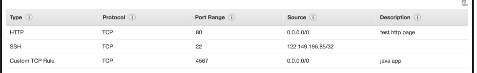

## 3.4 Classic Ports to know 
- Port 22 = SSH
- Port 21 = FTP
- Port 22 = SFTP
- Port 443 - HTTPS
- Port 80 - HTT
- Port 3389 - RDP - Remote Desktop protocol 

>**Exam Tip**: If there is a timeout, it most likely means because of security group

## 3.5 SSH Overview
- It can be used in:
   1. Mac
   2. Linux 
   3. Windows >= 10
- Windows < 10 - **Putty**
- **EC2 Instance Connect** - It can be used to connect to Mac, Linux and any windows version 
- It is used **via browser**
- Available for **Amazon linux**

## 3.6 EC2 Instances Purchasing Options 

### 1. EC2 On Demand
- Pay for what we use 
- **Linux or windows** - billing per second, after the first minute 
- All other operating system is billing per hour 

### 2. EC2 Reserved Instances
- Up to **72% discount** 
- **Reservation period - 1 year or 3 years**
- Payment options:
   1. No upfront
   2. Partial upfront 
   3. All upfront - **Maximum discount**
- Reserved instances are **scoped regional or Zonal**

### 3. EC2 Savings Plan 
- Upto **72% discount**
- **Commit to certain type of usage** ($10/hour for 1 or 3 years)
- Any usage beyound is billed On-Demand 
- commit to a **certain family and region** 

### 4. EC2 Spot Instances
- Upto **90% discount**
- Instances can be **lost at any time**

### 5. EC2 Dedicated Hosts
- A **physical server with EC2 instance capacity dedicated for our usage** 
- **BYOL - Bring your own license**
- Purchasing options:
   1. On-Demand
   2. Reserved Instances
- **Most Expensive option**

### 6. EC2 Dedicated Instances
- Instances run on **hardware that's dedicated to you**

### 7. EC2 Capacity Reservations
- **Reserve On-Demand instances capacity in a specific AZ** 
- **No time commitment and No billing discount** 

## 3.7 SPOT INSTANCE REQUESTS
- Upto **90% discounts**
- Define **max spot price** and get the instance while **current price < max spot price**
- Spot prices varies between AZ's
- **You can cancel spot instance requests that are open, active or disabled.** 
- **Cancelling a spot instance will not terminate instances**
- **Termination process** - Cancel spot request, and then terminate the spot requests 

## 3.8 SPOT FLEETS
- **Spot fleet = set of spot instances + On-Demand instances**
- Stops launching instances when:
   1. **Budget is met** 
   2. **Reaches allocation capacity** 

### Stratergies to allocate Spot instances
   1. **Lowest price**: Launch from pool from lowest price 
   2. **diversified** - Distributed across all pools 
   3. **capacityOptimized** - pool with optimal capacity
   4. **priceCapacityOptimizied** - pools with highest capacity available and matches with the lowest price

## 4. EC2 SOLUTIONS ARCHITECT ASSOCIATE LEVEL 
This session covers topic that is needed for SAA-C03 level

### 4.1 Private vs Public IP (IPv4)
- We have two types of IP
   1. IPv4: `1.160.10.240`
   2. IPv6: `2001:0db8:0000:0000:0000:0000:1428:57ab`
- IPv4 - 3.7b available services 
- IPv6 - Almost unlimited 

**PUBLIC IP**
- It means **machine can be indentified on the internet**
- Identified publicly 

**PRIVATE IP**
- It means **machine can be identified on a private network only.**
- IP must be **unique inside the private network** 
- Two different private can have the same IPs
- Only **specified range of IP can be uses**

**ELASTIC IP**
- It is used to have a **fixed Public IP**
- We can have only **5 Elastic IP** (can be increased)
-----

### 4.2 Placement Groups
- This defines the **placement of EC2 instances**, and they are defined by stratergies.

**Cluster stratergy**
- All of the **EC2 are going to be in the same AZ**
- Provides **great networking, low latency** 
- **Cons**: If AZ fails, all the instances fail 
- **Use case**: Big data Jobs
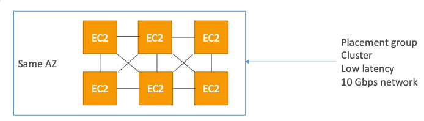

**Spread Startergy**
- All the **EC2 instances are located in different hardware/AZ**
- **Reduced risk in simultaneous failure**
- **Cons**: Limited to 7 instances per AZ
- **Use case:** Critical applications that need high availability 
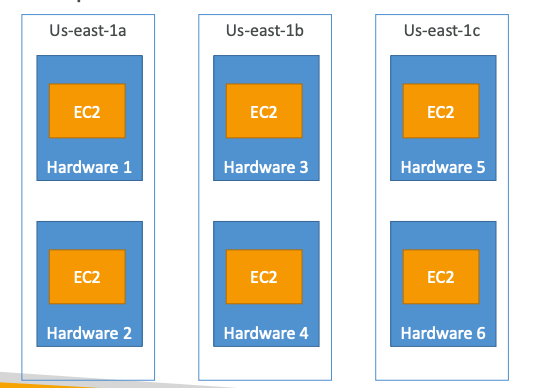

**Partition Stratergy**
- We can have **instances spread across multiple partitions inside a AZ**
- We can have upto to **7 partitions per AZ in the same region**
- **Use case**: Big data like Cassandra, Kafka, HDFS
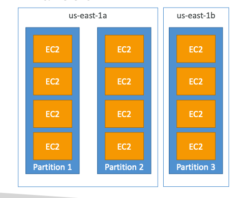
-----

### 4.3 Elastic Network Interface (ENI)
- Logical component in VPC and gives **virutal network card** for EC2 instances.
- They provide:
   1. **Private IP, and one or more secondary IPv4**
   2. **One Elastic IPv4**
   3. **One or more Secruity group and MAC address**
- They are **bound to specific AZ**
- **ENI can be moved across EC2 instances for failover purposes**
----
### 4.4 EC2 Hibernate 
- When an EC2 instance is hiberanated, the RAM(in-memory) state is preserved
- **Faster reboot**
- **Under the hood**: RAM is dumped into the EBS volume 
- **Use Cases**: Long-running processes
> **Exam Tip**: An instance cannot be hibernated for more than 60 days 
---
## 5. EBS OVERVIEW
This section talks about EBS volumes, snapshot, AMI and many more.

### 5.1 What is EBS Volume 
- It is a **network drive**that can be attached to EC2 instances
- It is used to **presist data** of an EC2 instance
- Can be **attached to a single EC2 instance at a time** 
- It is **bound to a single AZ**
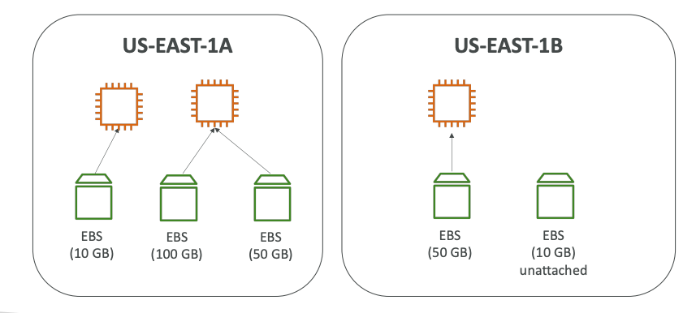
> **Exam Tip**: Two EBS Volumes can be attached to a single EC2 instance
---

### 5.2 EBS Snapshots
- It is a **backup of EBS volume**
- **Can be copied across regions and AZ** 

**EBS Snapshot Archive**
- **75% cheaper**
- **24 to 72 hours** for restoring 

**Recycle bin for EBS snapshort**
- Setup to **recover** snapshots from **accidental deletion.**
- **Retention** period is **1 day to 1 year**

**Fast Snapshot Restore (FSR)**
- **Forceful initialization of snapshot**
- **Expensive**
---

### 5.3 AMI Overview
- **AMI = Amazon Machine Image**
- Provide **customization of EC2 instances** 
- **Specific for region** 

---

### 5.4 EC2 Instance Store
- **Data is lost on EC2 termination** 
- Can be **attached to 100s of EC2 instances**
- Can be **attached instances across multiple AZ**
> **Exam Tip**: It is a ephemeral storage.
----

### 5.5 EBS Volume Types
There are 6 volumes types:

**gp2/gp3 - General Purpose SSD**

**Cost effective, low latency** 
- **gp3**: 
   1. newer version, **3000 IOPS** and **throughput** of **125 MiB/s**
   2. Can be **increase upto 16000** and **throughput** up tp **1000 MiB/s**.

- **gp2**:
   1. small gp2 volumes can burst upto **IOPS 3,000**
   2. can be extended till **16,000**
> **Exam tip**: **gp3 can independently setup IOPS an throughput, while gp2 is linked**

**Provisioned IOPS SSD (PIOPS)**
- Used for **applications that need more than 16,000 IOPS**
- **Use case**: **database workfloads**
- **io1**:
   1. Max IOPS: **64,000 for Nitro EC2** instances and **32,000 for others**
- **io2 Block Express**:
   1. **sub-millisecond latency**
   2. Max IOPS: **256,000** with I**OPS:GiB ratio of 1,000:1**

**Hard Disk Drives (HDD)**
- Cannot be a boot volume
- 125GiB to 16 TiB
**Throughput optimized HDD**
   1. **Max throughput: 500MiB/s - max IOPS 500**
   2. Used for big data 

**Cold HDD (sc1)**:
   1. For data that is infrequently accessed
   2. Scenarios where lowest cost is important 
   3. **Max throughput 250 MiB/s - max IOPS 250**
----

### 5.6 Multi-Attach EBS volume 
- **EBS volumes can be attached to multiple EC2 instances**
- **Allowed only for io1 and io2**
- **Scoped for a single AZ**
- **Maximum of 16 EC2 instances at a time** 

---
### 5.7 EBS Encryption 
- **Data at rest is encrypted**
- **All snapshots are encrypted**
- Leverages **KMS for encryption**

**Encrypt and Unencrypt EBS volume**
1. Create an EBS snapshot of a volume 
2. **Encrypt using a copy** 
3. Create **new volume from the snapshot** (volume also will be encrypted)

---

### 5.8 AWS EFS - Elastic File System 
- It is a **managed NFS (Network File system)** and can be **mounted on multiple EC2 instances.**
- **Works across multiple AZ**
- **Expensive**
- **Use case**: wordpress
> **Exam Tip**: **Only for Linux AMI, not available for Windows**

**EFS Storage Classes**
- **Standard**:For **frequently accessed files** 
- **EFS-IA**: Lower prices to restore the files 
- **Archive**: Rarely accessed data, **50% cheaper**

**Availability and durability**
- **Standard**: Multi AZ,**best for prod**
- **One zone**: One AZ, and for test and cheaper

### 5.9 EBS vs EFS
**EBS**
   1. One instance at a time (except io1, io2)
   2. locked at AZ level

**EFS**
   1. 100s of EC2 instances
   2. Across AZ
   3. Expensive 

> **Exam Tip**: Deleting an EC2 instance, by default r**oot volume will be deleted**, but **EBS volume wont be deleted by default**
> **Exam Tip**: `gp2`, `gp3` and `io1`,`io2` can be used as boot volume at the time of Ec2 instance creation 

----
## 6. ALB & ASG
This section covers around scalability and high availability.

### 6.1 Scalability & High Availability 
**Scalability**
- The ability of the system to **handle increase in workload**
- There are two kinds of scalability:
   1. Vertical Scalability 
   2. Horizontal Scalaility (**Elasticity**)

**Vertical Scalability**
- **Increase in size of instance**
- Use case: Database such as RDS

**Horizontal Scalability**
- **Increase the number of instances**
- Use case: web application 

**High Availabity**
- Goes hand in hand with Horizontal scalability 
- **Multi AZ deployment**
----

### 6.2 Load balancing 
- **Set of servers that forward traffic to multiple downstream servers**
- Have **health checks enabled**
- **AWS Managed service**

**Health checks**
- Check if **EC2 instance are working** before forwarding the requests

**Types of load balancer**
- There are 4 types of load balancer
   1. **Classic Load balancer - Deprecated**
   2. **Application Load Balancer - ALB** - **Http, https and websocket**
   3. **Network Load Balancer** - **TCP, TLS and UDP**
   4. **Gateway Load Balancer** - Operates at Layer 3 

### 6.3 Application Load Balancing 
- **Layer 7** 
- Route multiple **HTTP applications**
- **Supports** for **Websocket** and also redirect from **HTTP to HTTPS**
- Routing based on:
   1. path in URL
   2. hostname in URL
   3. Query strings, Headers
- Use case: **micro services**
- **Port mapping features**

**Application Load Balancer Target Groups**
- Ec2 instances
- ECS tasks
- Lambda functions
- IP addresses - private

**ALB Good to Know**
- **Fixed hostname** 
- The **application servers don't see the IP of the client directly**
- The true IP is inserted in header X-Forwarded-For

### 6.4 Network Load Balancing 
- **Layer 4 - TCP and UDP Traffic**
- Handle **millions of requests per second**
- **One static IP per AZ**

**Target Groups**
- Can be **Ec2 instances**
- Can be **IP addresses**
- Can be **Application Load Balancer**

> **Exam Tip**: Health checks supports TCP, HTTP and HTTPS Protocols
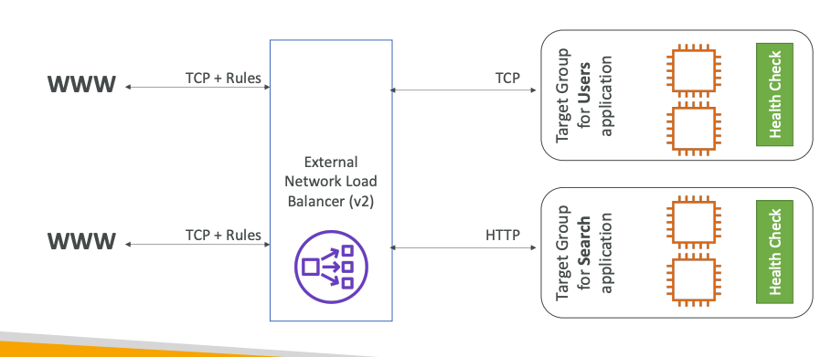

### 6.5 Gateway Load Balancer
- **Deploy, scale and manage third-party network virutal appliances in AWS**
- Example: Firewalls, ITPS(Intrusion Detection and Prevention Systems)
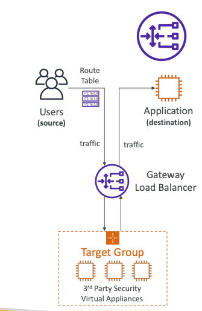
- Operates at **Layer 3**
- This combines the following functions:
   1. **Transparent Network Gateway**: Single entry and exit for all traffic 
   2. **Load Balancer** - Distributes the traffic 
- **GENEVE protocol on port 6081**

**Target Groups**
- EC2 instances
- IP addresses - Private 

### 6.6 Elastic Load Balancer - Sticky Sessions 
- Same client is always redirected to the same instance behind a load balancer
- For Classic Load Balancer, Application Load Balancer, and Network Load Balancer
- Stickyness can bring **instability** in the load balancing
- This makes use of **cookies** to happen, once expired the clients request might be moved to another instance

**Sticky Sessions - Cookie Names**
- **Application-based cookies**
   1. Custom cookie
   2. Generated by Application 
   3. Cookie name must be specified indivually for each target group 
   4. Cookie name is **AWSALBAPP**

- **Duration-based Cookies**
- Generated by load balancer
- Cookie name is **AWSALB** for ALB, **AWSELB** for CLB

### 6.7 Cross-Zone Load Balancing 
- **Each load balancer instance distributes evenly across registered instances in all AZ**
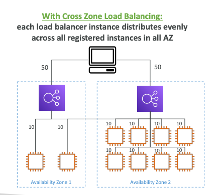

### 6.8 Without Cross-Zone Load Balancing
- Requests are distributed in the instances of the **node of the Elastic Load Balancer**
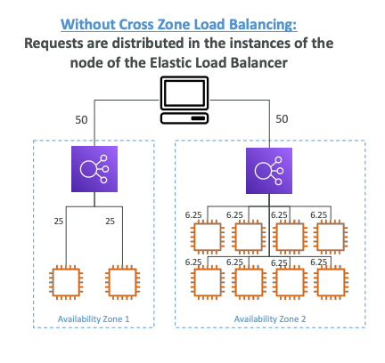

**Cross-Zone Load Balancing**

Application Load Balancer
   1. **Enabled** by default 
   2. **No charges** for inter AZ

Network Load Balancer & Gateway Load Balancer
   1. **Disabled** by default 
   2. **Pay extra charges**

### 6.9 SSL/TLS - Certificates
- SSL certs allow **traffic** between client and load balancer to be **encrypted** in transit (**in-flight encryption**)
- **SSL - Secure Socker Layer**
- **TLS - Transport Layer Security**
- Issued by **Certificates Authorities** (CA)
- Expiration date and needs to be renewed

**Load Balancer - SSL Certs**
- Users connect over HTTPS (S - secure/TLS) to load balancer.
- Internally, Load balancer does **SSL certs termination** and  in backend it talks to **EC2 using HTTP with Private network**
- Load balancer uses **X.509 certs**
- Certs can be **managed using ACM**
- We can upload our **own certs**
- Clients can use **SNI (Server Name Indication) to specify hostname they reach**

**SNI - Server Name Indication**
- Solves the problem of loading **multiple SSL certificates onto one web server**
- There is a **"newer" protocol** that needs to indicate the **hostname** and the **target server** at the initial handshake 
- Only works for:
   1. **ALB and NLB**
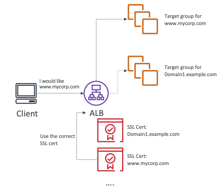

- **Classic Load Balancer** - single only one SSL cert
- **Application Load Balancer** - Supports multiple cert
- **Network Load Balancer** - Suppots multiple cert

### 6.10 Connection Draining 
- **Connection Draining** - CLB
- **Deregistration Delay** - ALB and NLB 
- Gives some time for instances to complete the active requests and until then it will be set to **Draining** state  
- Between 1 to 3600 seconds (defaut: 300 seconds)

### 6.11 Auto-Scaling group
- **Scale out** to match increase in load 
- **Scale in** to match decrease in load 
- Ensure we have minimum and maximum number of EC2 instances running 

> **Exam tip**: ASG is free, we pay for underlying instances being used 

**Auto Scaling - CloudWatch Alarms**
- It is possible to scale an ASG based on CloudWatch alarms 
- Alarms are triggered by metrics 

### 6.12 Auto Scaling Groups - Scaling Policies
**Dynamic Scaling**
   1. **Target Tracking scaling**
      - Simple to set-up
      - Example: I want avg ASG CPU to stay around 40%
   2. **Step scaling**
      - When a CloudWatch alarm is triggered then it adds/removes units
   3. **Schedules Scaling**
      - Anticipate scaling 
   4. **Predictive scaling**
      - LLM based scaling 
      - predicts and scales based on previous patterns 

**Auto Scaling Groups - Scaling Cooldowns**
- After a scaling activity, there is a scaling cool down that happens
- In that cooldown period, ASG will not launch additional instances 

**Exam Tips**
- An Elastic IP cannot be attached to an Application Load Balancer
- Reserved cookie names by ELB such as AWSALBAPP, AWSALBTG, AWSALB cannot be used for custome application based cookie 

## 7.  AWS RDS + AWS Aurora + ElastiCache 
This section talks about AWS managed Databases and in-memory such as ElastiCache

### 7.1 Amazon RDS Overview
- **RDS = Relational Database Service**
- Uses **SQL language** 
- It allows to create databases that are managed by AWS:
   1. Postgres
   2. MySQL
   3. MariaDB
   4. Oracle
   5. IBM DB2
   6. Aurora (AWS Proprietary Database)

### 7.2 Advantages of using RDS instead of deploying DB on EC2

- RDS is a managed service
   1. Provisioning and **automated patching **
   2. Continous **backups** are made 
   3. **Monitoring dashboard**
   4. **Read replicas**
   5. **Multi AZ**
   6. **Scaling** 

### 7.3 RDS - Storage Auto Scaling
- **Increase** **storage of DB instance dynamically** 
- **Scaling is automated** 
- Set **maximum threshold**

### 7.4 Read Replicas
- **Scale the read operation on your database**
- Upto **15 read replicas**
- It can be:
   1. Within AZ
   2. Cross AZ
   3. Cross Region
- **Replication is ASYNC** so reads are eventually consistent 
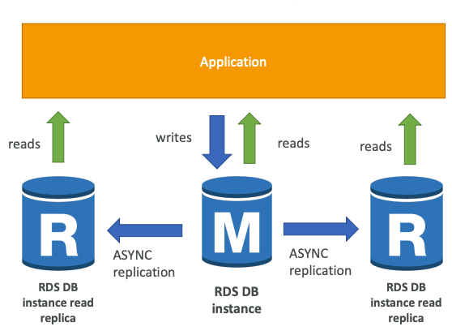

**RDS Read Replicas - Network Cost**
- In AWS there's a **network cost** when data goes from **one AZ to another** 
- Read Replicas within the same region, you don't pay that fee

### 7.4 RDS Multi AZ (Disaster Recovery)
- We have **SYNC replication** 
- **We get one DNS name - used for failover routing**
- **Read replicas can be set as AZ for disaster recovery**
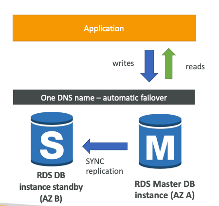
> **Exam Tip1**: Async: Primary writes → immediately tells you "done" → replica catches up later.

> **Exam Tip2**:Sync: Primary writes → ensures the standby has received the change → then confirms "done."

### 7.5 RDS - From Single AZ to Multi AZ
- It is **Zero downtime operatios**
- The following happens internally:
   1. A snapshot is taken 
   2. A new DB is created from the snapshot 
   3. Synchronization is established between two databases

**RDS CUSTOM**
- It is for **Oracle and Microsoftr SQL server** 
- Provides **OS and Database customization**
- We will **access to underlying infrastructure**

### 7.6 AWS Aurora
- **proprietary** technology
- **Postgres and MySQL are supported**
- **Automatically grows** in increments of 10GB upto 256 TB
- Upto to **15 read replicas**
- About **20% more than RDS**

### 7.7 Aurora High Availability and Read Scaling 
- **6 copies of your data across 3 AZ**:
   1. **4 copies** out of 6 for **write**
   2. **3 copies** out of 6 need for reads
   3. **Self healing** for data that is corrupted 
- **One Aurora instances takes writes**

### 7.8 Aurora DB Cluster
- **Data write will be go through writer Endpoint and even on a failover the data goes through this**
**Reader Endpoint recieves read requests and points them to one of the read replica**
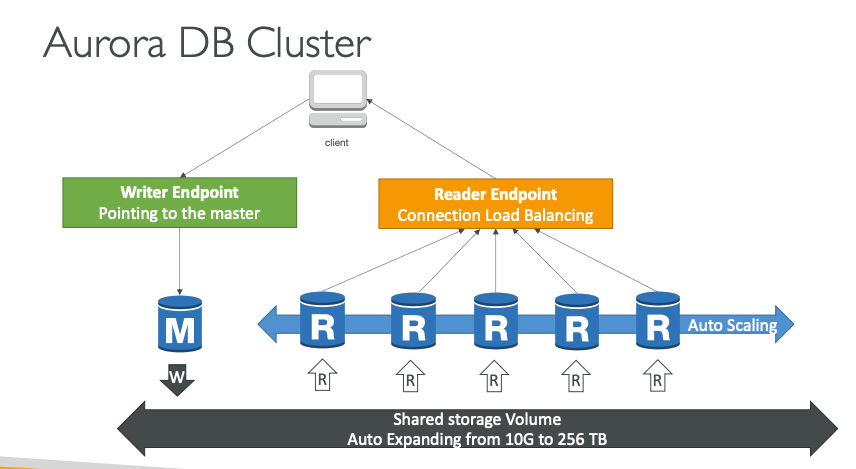

### 7.9  Aurora - Advances Concepts 

**Aurora Replicas - Auto Scaling**
- **Replica auto-scaling adds read replicas**
- The **Reader Endpoint will be extended** to ensure that the new read replicas also recieve the request

**Aurora Custom Endpoints**
- Define a subset of Aurora instances as a custom endpoint 
