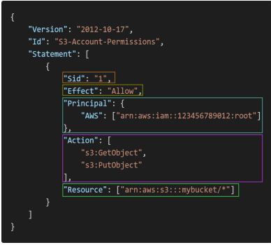

# AWS Certified Solutions Architect – Associate (SAA-C03)

## 1. AWS Global Infrastructure

AWS Global Infrastructure consists of:

- **AWS Regions**
- **Availability Zones (AZs)**
- **Data Centers**
- **Points of Presence (PoPs) / Edge Locations**

---

### 1.1 AWS Regions

An **AWS Region** is a geographical area that contains multiple isolated **Availability Zones**.

- Most AWS services and resources are **Regional**.
- Examples of Regional services:
  - Amazon EC2
  - Amazon RDS
  - Amazon VPC
  - Amazon Rekognition

> **Note:** Some AWS services are **Global**, while others are **Regional**.

---

### 1.2 How Do We Choose an AWS Region?

When selecting an AWS Region, consider:

1. **Compliance**
   - Regulatory requirements may require data to remain in a specific geographical location.

2. **Latency**
   - Choose a Region closer to users to reduce latency.

3. **Available Services**
   - Not every AWS service or feature is available in every Region.

4. **Pricing**
   - AWS pricing may vary between Regions.

---

### 1.3 AWS Availability Zones (AZs)

An **Availability Zone** consists of **one or more discrete data centers** within an AWS Region.

Characteristics:

- Each Region contains multiple **Availability Zones**.
- AZs are physically separated from one another.
- AZs are connected through **high-bandwidth, low-latency networking**.
- Deploying resources across multiple AZs improves:
  - **High Availability**
  - **Fault Tolerance**

> **Exam Tip:** For **High Availability**, distribute resources across **multiple Availability Zones**.

---

### 1.4 AWS Data Centers

AWS Data Centers provide the physical infrastructure that powers AWS services.

- A single **Availability Zone** can contain **one or more physically separate data centers**.
- Data centers contain the physical servers, storage, and networking infrastructure used by AWS.

---

### 1.5 AWS Points of Presence (PoPs) / Edge Locations

AWS Points of Presence include:

- **Edge Locations**
- **Regional Edge Caches**

They are primarily used by services such as:

- Amazon CloudFront
- AWS Global Accelerator

Their main purpose is to deliver content and network traffic closer to users and reduce latency.

---

### 1.6 AWS Global Services

Common AWS Global services include:

- **Identity and Access Management (IAM)**
- **Amazon Route 53**
- **Amazon CloudFront**
- **AWS WAF**

> **Important:** **Amazon Rekognition is a Regional service.**

---

# 2. IAM & AWS CLI

IAM stands for **Identity and Access Management**.

IAM is used to securely manage:

- **Authentication** → Who are you?
- **Authorization** → What are you allowed to do?

IAM is a **Global AWS service**.

---

## 2.1 IAM Users and Groups

### IAM Users

IAM Users typically represent:

- **People within an organization**
- Applications that require **long-term credentials**

### IAM Groups

IAM Groups are collections of IAM Users.

Important rules:

- A User can belong to **multiple Groups**.
- A User can belong to **zero Groups**.
- Groups **cannot contain other Groups**.

---

## 2.2 IAM Policies

IAM Policies define **permissions**.

Policies can be attached to:

- **IAM Users**
- **IAM Groups**
- **IAM Roles**

### IAM Policy Structure

A policy can contain:

- `Version` → Specifies the **policy language version**
- `Id` → **Optional** identifier for the policy
- `Statement` → **Required** and contains one or more permission statements

Each Statement can contain:

- `Sid` → **Optional** statement identifier
- `Effect` → **Required**; either `Allow` or `Deny`
- `Principal` → Depends on the **policy type**
- `Action` → AWS actions that are allowed or denied
- `Resource` → AWS resources to which the policy applies
- `Condition` → **Optional** conditions under which the policy applies

> **Important:** `Principal` is generally used in **Resource-Based Policies** and **IAM Role Trust Policies**. It is not normally included in an **Identity-Based Policy**.

### IAM Permission Example

---

## 2.3 IAM Policies – Inline vs Managed Policies

### Inline Policies

An **Inline Policy** is embedded directly into a single IAM identity.

It can be attached directly to:

- **IAM User**
- **IAM Group**
- **IAM Role**

Characteristics:

- Has a **one-to-one relationship** with the IAM identity.
- Cannot be reused across multiple identities.
- Deleted when the associated identity is deleted.

### Managed Policies

Managed Policies are standalone IAM policies that can be attached to multiple IAM identities.

There are two types:

#### AWS Managed Policies

Policies created and managed by **AWS**.

#### Customer Managed Policies

Policies created and managed by the **customer**.

> **Exam Tip:** Use **Managed Policies** when the same permissions need to be reused across multiple IAM identities.

---

## 2.4 IAM Password Policy

AWS allows you to configure an **IAM Password Policy**.

You can:

1. Set a **minimum password length**.
2. Require **specific character types**.
3. Allow IAM Users to change their own passwords.
4. Require Users to change their passwords after a specific period.
5. Prevent **password reuse**.

---

## 2.5 MFA – Multi-Factor Authentication

MFA adds an additional layer of security.

Authentication factors include:

- **Something you know** → Password
- **Something you have** → MFA Device

MFA should be enabled for:

- **AWS Root User**
- **IAM Users** with console access

### MFA Device Options

#### Virtual MFA Device

Examples:

- **Google Authenticator**
- **Authy**

These applications generate temporary authentication codes.

#### Hardware Security Key

Example:

- **YubiKey**

A physical security device used for authentication.

---

## 2.6 AWS Access Methods

AWS can be accessed in multiple ways:

- **AWS Management Console**
- **AWS Command Line Interface (CLI)**
- **AWS Software Development Kit (SDK)**

---

### AWS Management Console

The AWS Management Console is a web-based interface for managing AWS resources.

Authentication typically involves:

- **Username**
- **Password**
- **MFA**

---

### AWS Command Line Interface (CLI)

The AWS CLI allows users to interact with AWS using commands.

Authentication can use:

- **IAM Access Keys**
- **IAM Identity Center**
- **IAM Roles**
- Other AWS credential providers

IAM Access Keys consist of:

- **Access Key ID**
- **Secret Access Key**

> **Important:** An **Access Key ID** is not exactly the same as a username, and a **Secret Access Key** is not exactly the same as a password. They are **programmatic credentials** used to authenticate AWS requests.

---

### AWS Software Development Kit (SDK)

AWS SDKs allow applications to interact with AWS programmatically.

AWS provides SDKs for languages such as:

- **Python**
- **Java**
- **JavaScript**
- **Go**

---

## 2.7 AWS CloudShell

AWS CloudShell is a browser-based shell environment that allows you to run **AWS CLI commands** without installing the AWS CLI locally.

Key points:

- **AWS CLI is pre-installed**.
- You can run AWS commands directly from the browser.
- It provides temporary credentials based on your AWS login session.
- It is **Region-specific**.

> **Simple Definition:** AWS CloudShell is a managed environment for running **AWS CLI commands** directly from the AWS Management Console.

---

## 2.8 IAM Roles for Services

IAM Roles provide **temporary credentials** that can be assumed by:

- **AWS Services**
- **IAM Users**
- **Applications**
- **External Identities**

Instead of storing AWS Access Keys inside an application, assign an **IAM Role**.

Example:

**EC2 Instance** → **IAM Role** → **Permissions to access Amazon S3**

### Benefits

- Provides **temporary credentials**.
- Avoids hardcoding **Access Keys**.
- Improves security.
- Supports the **Principle of Least Privilege**.

> **Exam Tip:** If an AWS service needs permission to access another AWS service, an **IAM Role** is usually the preferred solution.

---

## 2.9 IAM Security Tools

### IAM Credentials Report

The **IAM Credentials Report** is an **Account-Level** report.

It lists IAM Users and the **status of their credentials**, including:

- Password status
- Access Key status
- MFA status
- Credential creation information
- Credential usage information

> **Use Case:** Use the **IAM Credentials Report** to audit credentials across all IAM Users in an AWS Account.

---

### IAM Access Advisor

IAM Access Advisor helps identify services that have been accessed by an IAM identity.

It shows:

- Services for which permissions are assigned.
- When a service was **last accessed**.

It can help you:

- Identify **unused permissions**.
- Review excessive permissions.
- Revise IAM Policies.
- Apply the **Principle of Least Privilege**.

> **Exam Tip:** Use **IAM Credentials Report** to review credentials across IAM Users. Use **IAM Access Advisor** to identify service usage and help refine permissions.

---
# 3. AWS EC2 - Elastic Compute Cloud
- Elastic Compute Cloud = **Infrastructure as a Service.**

## 3.1 EC2 sizing & Configuration options 
- **Operating system (OS)**: Linux, Windows or Mac OS.
- **compute power and cores (CPU)**
- **Random Access Memory**
- **Storage space**
- **Network card**
- **Firewall rules**
- **Bootstrap script** 

- **Bootstapping** means launching the commands when the machine starts. It can be **run only once** when the instance first starts.

## 3.2 EC2 INSTANCE TYPES
- There are 7 types of EC2 Instances 
