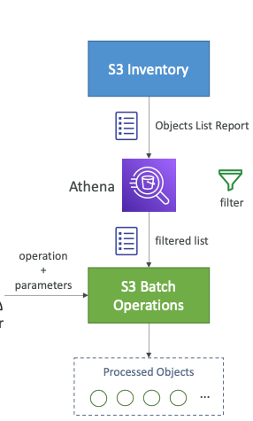
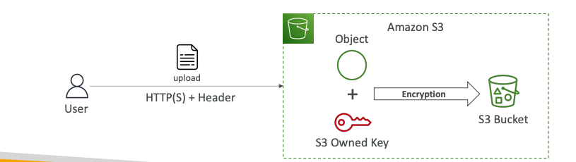

## 9.0 Solutions Architecture Discussions

This section covers solutions architecture concepts and their design.

### 9.1 Stateless Web Application: WhatIsTheTime.com — Solution Architecture 1

**Requirements**

- Allows users to determine the current time
- Does not require a database
- Starts with a small infrastructure
- Can initially accept downtime

**Scenario 1: Initial Architecture**

**Architecture:**

- One public EC2 instance
- One Elastic IP address providing a static public IP

**Result:** The application works as expected.

**Scenario 2: Increase in the Number of Users**

**Approach: Vertical Scaling**

- Increase the EC2 instance size from `t3.micro` to `M5`.

**Result:** Upgrading the instance causes downtime, leaving users dissatisfied.

**Scenario 3: Horizontal Scaling**

**Approach:**

- Continue using `M5` instances.
- Add more EC2 instances.
- Assign one Elastic IP address to each instance.

**Result:** The additional capacity improves the user experience.

**Scenario 4: Route 53**

**Approach:**

- Configure an **A record** in Route 53.
- Return the IP addresses of the EC2 instances.
- Eliminate the Elastic IP addresses.

**Limitation:** Scaling the EC2 instances remains difficult.

**Result:** The architecture is more optimized.

**Scenario 5: Load Balancing**

**Approach:**

- Introduce a public-facing load balancer.
- Protect the EC2 instances using a security group.
- Configure health checks on the load balancer.
- Use an **Alias record** to route traffic from Route 53 to the AWS resource.

**Request flow:**

`Route 53 → Load Balancer → EC2 Instances`

**Scenario 6: Auto Scaling Group**

**Approach:**

- Add an Auto Scaling Group to the existing architecture.
- Deploy the architecture within a single Availability Zone.
- Scale in and scale out based on demand.

**Result:** The solution is close to being a good architecture.

**Scenario 7: Disaster Recovery**

**Approach:**

- Deploy the architecture across multiple Availability Zones.
- Continue scaling in and out based on demand.

**Result:** The solution is close to being a good architecture and provides improved disaster recovery.

**Scenario 8: Cost Optimization**

At least one EC2 instance must run in each Availability Zone. Because these instances are always required, use **Reserved Instances** instead of **On-Demand Instances** to reduce costs.

---

### 9.2 Stateful Web Application: MyClothes.com — Solution Architecture 2

**Requirements**

- Allows users to purchase clothes online
- Provides a shopping cart
- Supports hundreds of users at a time

**Scenario 1: Initial Architecture**

**Approach:**

- Reuse the architecture from Solution Architecture 1.

**Problem:**

A user logs in and accesses the application through the first EC2 instance. After adding an item of clothing to the shopping cart, the user attempts to open the cart. However, the request is routed to the second EC2 instance, where the session data is unavailable. As a result, the cart appears empty.

**Scenario 2: Session Stickiness**

**Approach:**

- Enable session stickiness so that requests from the same user are routed to the same EC2 instance.

**Result:** This improves the user experience. However, if the EC2 instance is terminated, the session data is still lost.

**Scenario 3: Cookies**

**Approach:**

- Store the shopping-cart contents on the user's device instead of on the EC2 instances.
- Store this information using web cookies.

**Result:** The application becomes stateless. However, cookies can be modified and must be smaller than 4 KB.

**Scenario 4: Server-Side Sessions**

**Approach:**

- Create a server-side session.
- Store the session information in ElastiCache using a session ID.
- When the user sends another request, use the session ID to retrieve the corresponding information from ElastiCache.

**Result:** This provides faster performance and improved security.

**Scenario 5: RDS and RDS Read Replicas**

**Approach:**

- Store and retrieve user data using Amazon RDS.
- Use RDS Read Replicas for read-intensive workloads.

**Scenario 6: Multi-AZ Disaster Recovery**

**Approach:**

- Use a Multi-AZ architecture for all applicable components.
- Configure security groups wherever required.

---

### 9.3 Stateful Web Application: MyWordPress.com — Solution Architecture 3

**Requirements**

- Provides a fully scalable WordPress website
- Allows users to access the website and view the correct image updates

**Scenario 1: Initial Architecture**

**Approach:**

- Reuse the architecture from Solution Architecture 1.
- Use Amazon Aurora instead of Amazon RDS.

**Result:** The application provides better scalability.

**Scenario 2: EBS Volume**

**Approach:**

- Use an EBS volume to store images.

**Result:** An EBS volume can be attached to only one EC2 instance at a time.

**Scenario 3: EFS Instead of EBS**

**Approach:**

- Use Amazon EFS to store images.

**Result:** Amazon EFS can be attached to multiple EC2 instances at the same time.

----

### 9.4 Elastic BeanStalk
- **Platform as a Service (PaaS)**
- Developer centric view of deploying an application on AWS
- Managed service:
    1. Scaling 
    2. Deploying 
    3. Load balacning 
    4. Provisioning
- **Developer manages the code**
- **Service = free; pay for underlying resources**

### 9.5 Elastic Beanstalk - Components
- Application 
- Application Version
- Environment 
- Tiers

## 10. Amazon S3 Overview
This section covers S3 overview topics for SAA C03. However, we do have S3 Advanced in the next section 

### 10.1 Amazon S3 Introduction & Use Cases
- **Infintely scaling resource**

**Use cases**
1. Backup and storage 
2. Disaster recovery 
3. Archive
4. Hybrid Cloud storage 
5. Application hosting & Media hosting
6. Static website

### 10.2 Amazon S3 - Buckets 
- Buckets are **directories** inside S3
- **Regional level**
- Naming was globally unique previously - We now have account regional name
- **AWS adds suffix** to it 
- Naming constraints:
    1. No Uppercase, No Underscore
    2. Not an IP
    3. Must start with lowercase/Number
    4. Not start with the prefix xn--

### 10.3 Amazon S3 - Objects
- **They are files and have key**
- Key defines the **full path**
- **Key = prefix + object name**  
- **Max size - 50TB**; If greater use **Multi-part upload**
- **Tags and versioning are available**

### 10.4 Amazon S3 - Security
- **User-Based**:
    1. IAM Policies
    2. Bucket Policies
        - allow users to come in/ also from cross account 
        - Make bucket public
    3. Object Access Control List 
- Encrypt using KMS 

- **S3 Bucket Policies**
- JSON based policies
- It can be used for:
    1. **Grant public access to the bucket**
    2. **Force objects to be encrypted**
    3. **Grant access to another account** 

### 10.4 Amazon S3 - static website 
- Website URL depends on **region hosted**
- S3 can host static website and are accessible via internet 

### 10.5 Amazon S3 - Versioning 
- Enabled at **bucket level** 
- **Versions the upload to the objects** 
- Uses:
    1. Restore
    2. Backup/rollback

### 10.6 S3 Repication 

**CRR - Cross Region Replication & SRR - Same Region Replication**
- **Asynchronous replication** 
- Inter-Region and Same-Region
- **Use cases CRR:**
    1. Compliance
    2. Lower latency
- **Use cases SRR**
    1. Log aggregation
    2. live replication 

- After enabling replication, **only new objects are replicated** 
- Existing can be done using **S3 batch replication** 

### 10.7 S3 Storage Classes

**S3 Standard**
- **99.99% availability**
- **Frequently accessed data**
- **Low Latency and high throughput**
- Use cases: Big data, gaming 

**S3 Standard-Infrequent Access**
- **99.9% availability**
- **Lower cost compared to S3 Standard**
- **Less frequent accessed**, but when accessed **rapid access**
- Use case: Disaster Recovery

**S3 One Zone-Infrequent Access**
99.5%
- **Single Az**; data lost is AZ is impacted 

**S3 Glacier Storage**
- **Lowest price**
- **Pricing: Storage + object retrieval cost** 

**Amazon S3 Glacier Instant Retrieval**
- **Millisecond retrieval**
- **Minimum duration of 90 days**

**Amazon S3 Glacier Flexible Retrieval**
- **Expedited (1 to 5 minutes), standard(3 to 5 hours), Bulk (5 to 12 hours)**
- **Minimum duration of 90 days** 

**Amazon S3 Glacier Deep Archive**
- **Long term storage** 
- **Lowest of all in cost**
- **Standard (12 hours), Bulk 48 hours**
- **Minimum 180 days**

**Amazon S3 Intelligent-Tiering**
- **Move objects automatically based on usage** 
- **Auto-tiering and monitoring fee but not retrieval fee**

**S3 Express One Zone**
- **High performance, Single AZ**
- **Stored in directories instead of buckets**
- **Milli-second latency**

## 11. Amazon S3 Advanced
This covers topics such as Lifecycle rules, Event notifications, Performance, Batch operations and S3 storage lens 

### 11.1 Amazon S3 - Moving Between Storage Classes
- Storage of objects can be transitioned between storage classes
- This can be automated by making use of **Lifecycle rules**

**Transition Actions**
- objects to transition to another storage class 
- Example: Move to Standard IA class after 60 days of creation

**Expiration Actions**
- configure objects to expire after some time 
- Example: Access log files can be deleted after 365 days

**Amazon S3 - Lifecycle Rules (Scenario 1)**
>Your application on EC2 creates images thumbnails after profile photos are uploaded to Amazon S3. These thumbnails can be easily recreated and only need to be kept for 60 days. The source images should be able to be immediately retrieved for these 60 days, and afterwards, the user can wait up to 6 hours. How would you design this

Solution:
- S3 source image can be on the **standard class for 60 days** and then transition them to **Glacier after 60 days**
- **Thumbnails** can be on **One-Zone IA**, as they can be **recreated** if lost. Lifecycle config to **delete after 60 days**

**Amazon S3 - Lifecycle Rules (Scenario 2)**
> A rule in your company states that you should be able to recover your deleted S3 objects immediately for 30 days, although this may happen rarely. After this time, and for up to 365 days, deleted objects should be recoverable within 48 hours.
Solution:
- Enable **S3 versioning** for marking deleted objects and can be recovered
- Transition **non-current** version objects to **standard IA**
- Later transition them to **Glacier Deep Archive**

### 11.2 Amazon S3 - Analytics
- Helps you decide when to **transition objects to the right storage class**
- Recommendation:
    1. Standard and Standard IA
    2. Do **NOT** work for **One-Zone IA or Glacier**

### 11.3 S3 Requester Pays
- Bucket owner pays for all S3 storage and data transfer cost associated with it 
- **With Requester Pays bucket**, the requester instead of the bucker owner pays the cost of the request and downloads the data from the bucket
- **Requester must be authenticated**

### 11.4 S3 Event Notifications
- Event are actions happening inside the S3 bucket
- Event notifications can be sent to certain **destination endpoints such as SNS, SQS, Lambda functions**
- We need **IAM policies** configured for performing Event notifications/Actions

### 11.5 S3 Baseline Performance 
- Amazon S3 automatically scales to high request rates, latency 100-200ms
- We can get **3500 PUT/COPY/POST/DELETE** OR **5500 GET/HEAD requests per second per prefix**

**Multi-Part upload**
- **Recommended** for files **> 100MB**
- **MUST** use for files **> 5GB**

**S3 Transfer Accerleration**
- **Increase transfer speed** by transferring file to an AWS edge location which will forward the data to the S3 bucket in the target region via AWS internal network systems

**S3 Performance - S3 Byte-Range Fetches**
- **Parallelize GETs** by requesting specific range of bytes
- **Increase the speed of download**

### 11.6 S3 Batch Operations
- **Peform bulk operations on exisiting S3 objects with a single request**
- **Encrypt all unencrypted objects** 

### 11.7 S3 - Storage Lens 
- **Understand, Analyze and optimize storage across entire AWS organization**
- **Aggregate data** for Organization level, specific accounts,regions, buckets or prefixes
- Use **default or custome dashboards**

**Storage Lens - Default Dashboard**
- **Preconfigured** by Amazon S3
- **Multi-Region and Multi-Account data**
- **Can't be deleted, but can be disabled**

### 11.8 Storage Metrics
**Summary Metrics**
- General insight about S3 storage 
- To identify fast growing, unused buckets

**Cost Optimization**
- Provide insights to manage and **optimize storage costs**
- To identify which objects can be transitioned for better cost savings

**Data-Protection Metrics**
- **data protection feature insights**
- Enable versioning etc.

**Access Management metrics**
- Insights for S3 Object ownership

**Event Metrics**
- Insights into **S3 Event nofitication**

**Performance Metrics**
- Insight for **S3 Transfer Acceleration** 

**Activity Metrics**
- Provide insights about how **storage is requested**

### 11.9 Free Metrics vs Paid Metrics

**Free Metrics**
- Contain around **28 usage metrics**
- **Data available for queries for 14 days** 

**Advances Metrics**
- CloudWatch Publishing
- Advances metrics
- Data available for queries for **15 months**

---
## 12 Amazon S3 - Security 
This section covers the security aspect associated with S3 security 

### 12.1 Amazon - S3 Object Ecnryption
- We can encrypt objects in amazon S3 using 4 methods
    1. Server-Side Encryption (SEE)
    2. Client-Side Encryption 

**Amazon S3 Encryption - Server Side Encryption**
- **Default**
- **Keys handled, managed and owned by AWS**
- Encryption type is **AES-256**
- Must set header **"zamz-server-side-encryption":"AES256"**

**Amazon S3 Encryption - Server-Side Encryption - KMS**
- Keys are managed and owned by **KMS** (Key Management Service)
- Can be created and managed by the customer
- **"z-amz-server-side-encryption":"aws:kmz"**

**SSE-KMS Limitation**
- Has its own API, it calls its own API's for decrypting and has quota limit

**Amazon S3 Encryption - SSE-C**
- **Encryption keys managed by AWS outside of AWS**
- S3 does **NOT** store these keys 
- **HTTPS** protocol must be used 

**Amazon S3 - Client-Side Encryption**
- Use libraries such as **Client-Side Encryption Library**
- Client must **encrypt** data before sending into S3
- **Decryption** also happens **outside AWS**
- **Customer manages the keys** 

**Amazon S3 - Encryption in transit (SSL/TLS)**
- Also called **SSL/TLS**
- Amazon S3 exposes **two endpoints**:
    1. **HTTP Endpoint**: non encrypted
    2. **HTTPS Endpoint**: Encryption in flight

### 12.2 Amazon S3 - Default Encryption vs Bucket Policies
- All buckets have **SSE-S3 by default**
- **Encyrption can be forced using Bucket policy**

### 12.3 Amazon S3 - CORS
- **CORS - Cross-Origin Resource Sharing**
- **Origin = Scheme(Protocol) + Host + Port**
- **CORS is web browser based mechanism to allow requests to other origins while visiting the main origin**
- **Same Origin:**  Contains same Scheme, Same port and Same host
- Example:`http://example.com/app1 & http://example.com/app2`
- **Different Origin**: Contains different Scheme, or Host or Different Port
- Exmaple: `http://www.example.com & http://other.example.com `