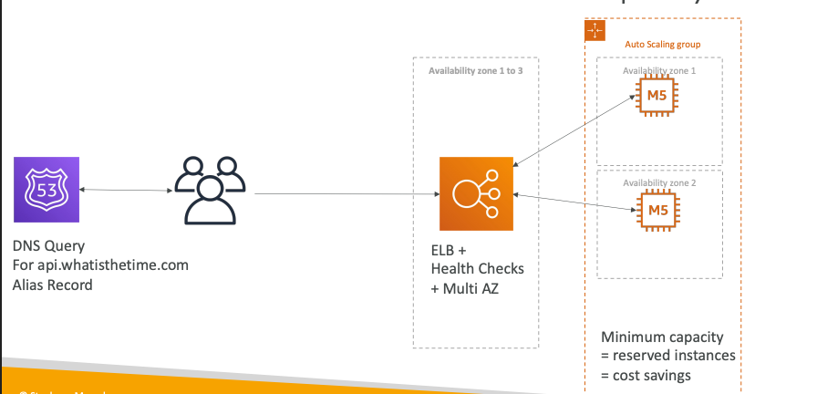
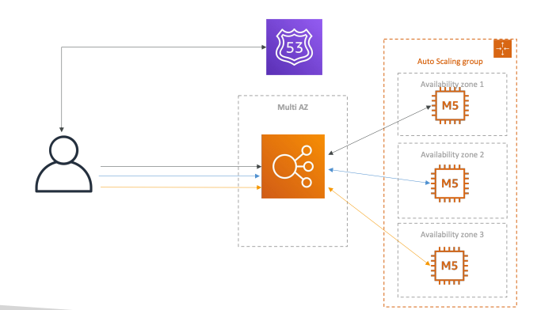

# AWS Certified Solutions Architect – Associate (SAA-C03) Vol 2

## 9.0 Solutions Architecure Discussions 
This section covers the topic of solutions architecture and their design 

### 9.1 Statless Web App: WhatIsTheTime.com - Solution Architecture 1
- Allows people **know what the current time**
- **No Database**
- Start small - **Accept downtime**

**Scenario 1 : Initially**
- Public EC2 instance
- Elastic IP - static public IP
- **Result**: Application is working alright.

**Scenario 2 - Increase in No Users**
- **Vertical Scaling** - Increased the instance size from t3.micro to M5
- **Result** - The upgrading had downtime and users were unhappy

**Scenario 3 - Scaling Horizontally**
- **Horizontal scaling:** Instance size M5 itself 
- **Number of instances = Number of Elastic IP**
- **Result** - Users are happy

**Scenario 4 - Route53**
- **Route53** - setup **A record** and return the IP for the EC2 instances and **eliminate Elastic IP**
- We cannot **scale instances**
- **Result** - Optimization

**Scenario 5 - Load Balancing**
- **Load Balancer:** **Public facing load balancer, EC2 instances protected by Security Group**
- Load balancer also has **Health checks**
- We use **Alias Record**; **Route53 -> AWS Resource**

**Scenario 6 - Auto Scaling Group**
- For the above architecture use ASG, with **single AZ**
- Scale in and Scale out on demand 
- **Result**- Almost a good architecture

**Scenario 7 - Disaster Recovery**
- Use **Multi AZ**
- Scale in and Scale out on demand 
- **Result**- Almost a good architecture

**Scenario 8 - Cost optimization**
- We now know, we atleast need one EC2 instance running in each AZ; Choose **Reserved instances instead of On-Demand**

\

### 9.2 Statefull Web App: MyClothes.com - Solution Architecture 2
- Allow people **buy clothes online**
- **Shopping cart** 
- **Hundreds of user at a time**

**Scenario 1 : Scenario 1 Architecture**
- we pick the same architecure from Solution Architecture 1
 
- A user logs in and accesses the application through the first EC2 instance. After adding an item of clothing to the shopping cart, the user attempts to open the cart. However, the request is routed to the second EC2 instance, where the session data is unavailable, causing the cart to appear empty.

**Scenario 2 : Stickyness**
- This time, the request's of the same user goes to the same EC2 instance
- **Result**: Improvement; But if the **Ec2 instance is terminated for some reason. We still loose the data**

**Scenario 3 : Cookies**
- Here, the **user stores the shopping content**, instead of Ec2 instances
- Done **via Web cookies**
 